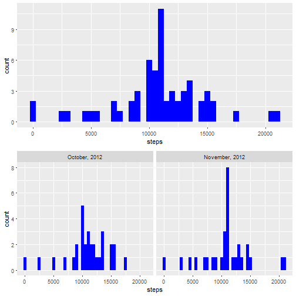
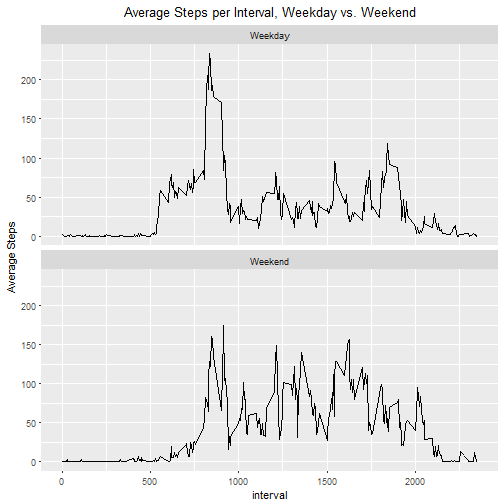

## Introduction

It is now possible to collect a large amount of data about personal movement using activity monitoring devices such as a Fitbit, Nike Fuelband, or Jawbone Up. These type of devices are part of the "quantified self" movement - a group of enthusiasts who take measurements about themselves regularly to improve their health, to find patterns in their behavior, or because they are tech geeks. But these data remain under-utilized both because the raw data are hard to obtain and there is a lack of statistical methods and software for processing and interpreting the data.

This assignment makes use of data from a personal activity monitoring device. This device collects data at 5 minute intervals through out the day. The data consists of two months of data from an anonymous individual collected during the months of October and November, 2012 and include the number of steps taken in 5 minute intervals each day.

## Dataset

The variables included in this dataset are:

1. Steps: Number of steps taking in a 5-minute interval (missing values are coded as NA)
2. Date: The date on which the measurement was taken in YYYY-MM-DD format
3. Interval: Identifier for the 5-minute interval in which measurement was taken

Install and load necessary packages

```r
library(ggplot2)

library(dplyr)

library(lubridate)

library(gridExtra)
```


#### 1. Code for reading in the dataset and/or processing the data


```r
##set the name of the zip folder
destfile="./ActiveMonitorData/data.zip"

##the web address of the data from the Coursera website
fileURL <- "https://d396qusza40orc.cloudfront.net/repdata%2Fdata%2Factivity.zip"   

##if the destfile doesn't already exist in the local dir, begin download and unzipping
if (!file.exists(destfile)) {
        dir.create('ActiveMonitorData')
        download.file(fileURL ,destfile) 
        unzip("./ActiveMonitorData/data.zip", exdir = "./ActiveMonitorData")
}

##set local directory to the newly created data directory
setwd("./ActiveMonitorData")

##Read Activity file
data <- read.csv("activity.csv")
```


Edit the data frame


```r
ActData <- tbl_df(mutate(data, popDay = as.numeric(data$date)))

ActDate <- as.POSIXlt(ActData$date, format = "%Y-%m-%d")

ActData$weekday <- weekdays(ActDate)

ActData$weekend <- ifelse(ActData$weekday == "Saturday" | ActData$weekday == "Sunday", "Weekend", "Weekday")

ActData$month <- as.factor(month(ActData$date))

ActData$Day_of_Month <- as.numeric(format(as.Date(ActData$date, format = "%Y-%m-%d"), "%d"))

levels(ActData$month) <- c("October, 2012", "November, 2012")
```


#### 2. Histogram of the total number of steps taken each day.


```r
byday <- group_by(ActData, popDay, month, Day_of_Month) %>% filter(!is.na(steps))

sumDay <- summarise(byday, steps = sum(steps))

plot1 <- ggplot(sumDay,aes(x=steps))+geom_histogram(binwidth = 500, fill = "blue")+ggtitle("Total Steps per Day")+theme(plot.title = element_text(hjust = 0.5))+ylab("frequency")

plot2 <- ggplot(sumDay,aes(x=steps))+geom_histogram(binwidth = 500, fill = "blue")+facet_grid(.~month) +ylab("frequency")

grid.arrange(plot1, plot2, nrow=2, ncol=1)
```


#### 3. Mean and median steps


```r
meanSteps <- mean(sumDay$steps, na.rm = T)

meanSteps
```

```
## [1] 10766.19
```

```r
medianSteps <- median(sumDay$steps, na.rm = T)

medianSteps
```

```
## [1] 10765
```


#### 4. Time Series plot of the average number of steps taken


```r
byInt <- group_by(ActData, interval)%>% filter(!is.na(steps))

avgInt <- summarise(byInt, avgSteps = mean(steps, na.rm = T))

ggplot(avgInt, aes(x=interval, y=avgSteps))+geom_line()+ggtitle("Average Steps per Interval")+theme(plot.title = element_text(hjust = 0.5))+ylab("Average Steps")
```


#### 5. The 5-minute interval that, on average, contains the maximum number of steps


```r
top6 <- head(arrange(avgInt, desc(avgSteps)))

top6
```

```
## # A tibble: 6 × 2
##   interval avgSteps
##      <int>    <dbl>
## 1      835 206.1698
## 2      840 195.9245
## 3      850 183.3962
## 4      845 179.5660
## 5      830 177.3019
## 6      820 171.1509
```

The interval with highest average steps was interval 835 with a value of 206 steps.


#### 6. Code to describe and show a strategy for imputing missing data


```r
ActDataFill <- merge(ActData, avgInt, by = "interval")

ActDataFill$fillsteps <- ifelse(is.na(ActDataFill$steps), ActDataFill$avgSteps, ActDataFill$steps)

ActDataFill <- ActDataFill[order(ActDataFill$date),]
```


####7. Histogram of the total number of steps taken each day after missing values are imputed


```r
bydayNoNA <- group_by(ActDataFill, popDay, month, Day_of_Month)

sumDayNoNA <- summarise(bydayNoNA, steps = sum(fillsteps))

plot1 <- ggplot(sumDayNoNA,aes(x=steps))+geom_histogram(binwidth = 500, fill = "blue")

plot2 <- ggplot(sumDayNoNA,aes(x=steps))+geom_histogram(binwidth = 500, fill = "blue")+facet_grid(.~month)

grid.arrange(plot1, plot2, nrow=2, ncol=1)
```



#### 8. Panel plot comparing the average number of steps taken per 5-minute interval across weekdays and weekends


```r
byIntW <- group_by(ActData, interval, weekend)%>% filter(!is.na(steps))

avgIntW <- summarise(byIntW, avgSteps = mean(steps, na.rm = T))

plot <- ggplot(avgIntW, aes(x=interval, y=avgSteps))+geom_line()+
        facet_wrap(~weekend, ncol = 1, nrow = 2)+
        ggtitle("Average Steps per Interval, Weekday vs. Weekend")+
        theme(plot.title = element_text(hjust = 0.5))+
        ylab("Average Steps")
print(plot)
```


